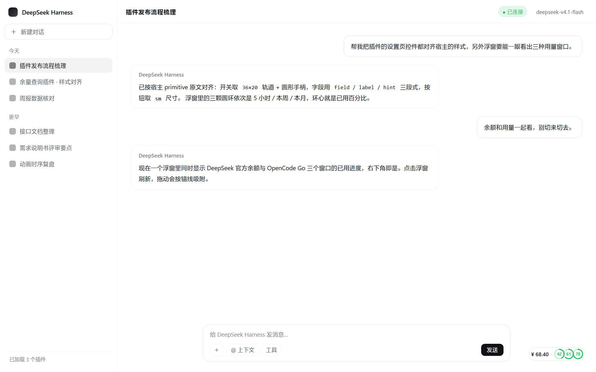
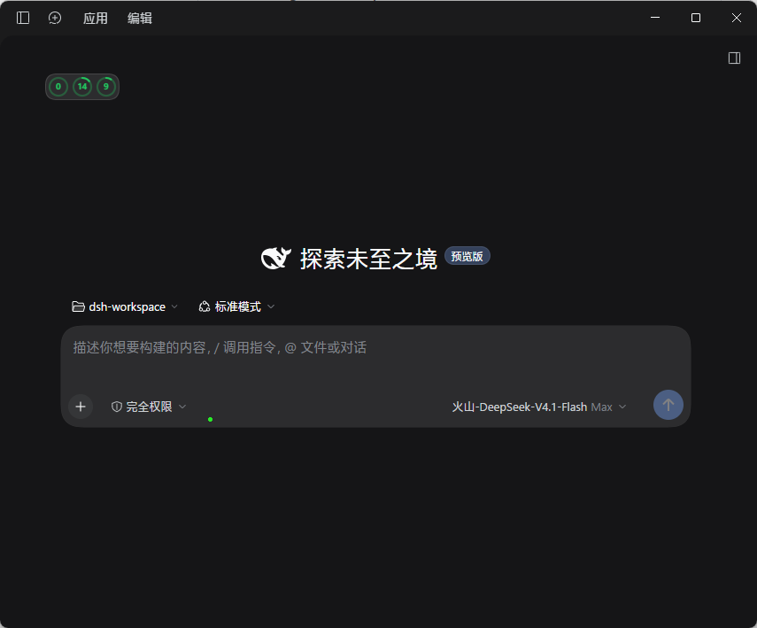
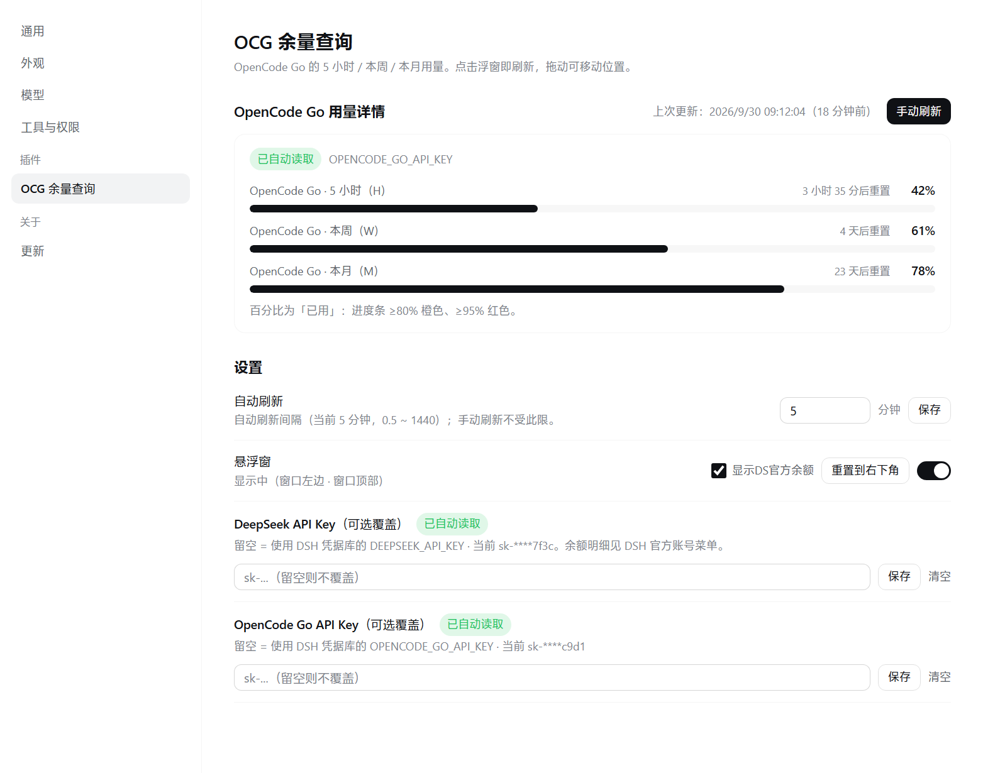
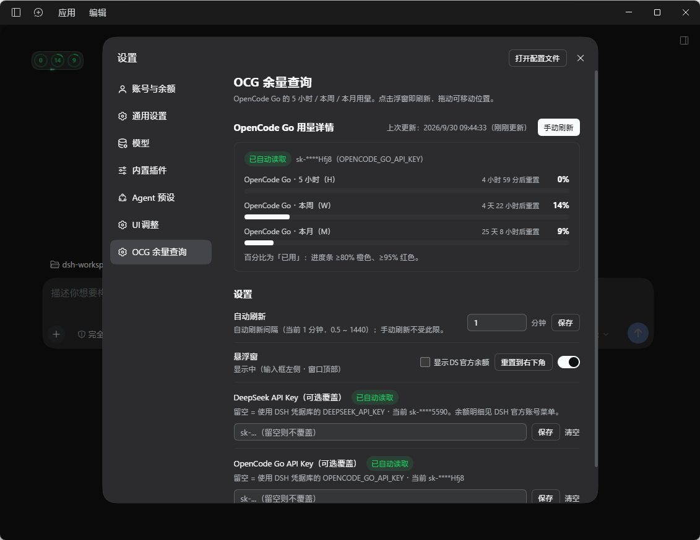
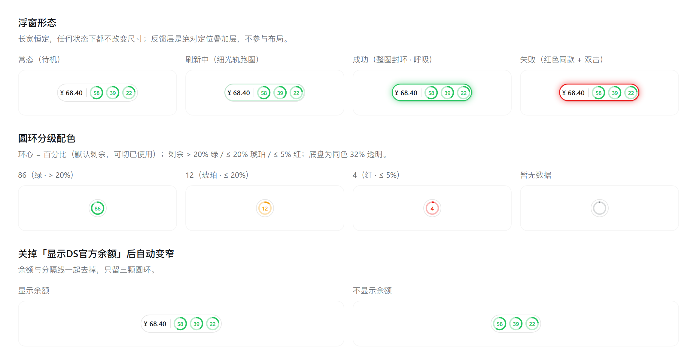

# OCG Usage Monitor · dsh-opencode-go-usage

[中文](README.md) · **English**

[](LICENSE)

An unofficial **DeepSeek Harness** client plugin that merges your **DeepSeek account balance** and your **OpenCode Go** usage across three windows — **5-hour (rolling) / weekly / monthly** — into a **single floating pill**, and ships a settings page of the same name.

## Screenshots

> The first four are **real screenshots from the DSH desktop app** (light / dark). The last one is a rendered illustration of the states and colour grades — a moving light rail and a closing ring are hard to capture as a stable frame.

| Pill · light                            | Pill · dark                           |
| --------------------------------------- | ------------------------------------- |
|  |  |

| Settings · light                              | Settings · dark                             |
| --------------------------------------------- | ------------------------------------------- |
|  |  |

| States & colour grades (illustration: refreshing / success seal / failure / three grade colours / narrowed after hiding the balance) |
| ------------------------------------------------------------ |
|      |

## Features

- **Two datasets in one pill**: DeepSeek balance (`¥` amount) + OpenCode Go usage for three windows; **click the pill to refresh both** (fetched together — a failure on one side does not affect the other).
- **Three rings**: each ring's centre shows the **used percentage** (no `%` sign); < 80% green, ≥ 80% amber, ≥ 95% red; the unused track is the same colour at 32% opacity, so every ring reads as one piece.
- **Hairline light rail**: while refreshing, a hairline of light runs around the pill's perimeter at **constant arc-length speed**; on completion it **closes into a full ring** at the head's current position; failures use the same effect in red.
- **Drag to snap**: on release the pill snaps to the nearest reference line (composer card edge / window edge) and keeps following it when the window resizes, the side panel opens, or the chat width changes.
- **Fixed size**: the pill never changes size in any state (the feedback layer is an absolutely positioned overlay that does not participate in layout).
- **Zero dependencies**: plain JavaScript — **no build step, no third-party runtime dependencies** (only `require('react')`, provided by the host).
- **Bilingual UI**: every interface string goes through the client locale dictionaries and follows the DSH language setting instantly (pill, settings page, menu label and all action messages).
- **Theme aware**: colours come only from host theme tokens (`--dsw-alias-*`), so light/dark follow automatically; switches, buttons, inputs and badges are copied from the host's own components (only the class prefix is renamed).

## Installation

**Requirements**: DeepSeek Harness desktop (the app bundles node / pnpm — nothing else to install). This plugin follows the official DSH plugin conventions: you do **not** hand-edit the profile's `package.json` / `cordis.patch.yml`, and you should not run pnpm inside the profile directory.

In DSH, open the **plugin manager → “Install plugin” dialog → paste one of the specs below → install** (the dialog drives pnpm and installs one spec at a time):

| Method                    | Spec to paste                                                                                                    |
| ------------------------- | ---------------------------------------------------------------------------------------------------------------- |
| **Straight from GitHub** (recommended) | `github:verneuil/dsh-opencode-go-usage`                                                              |
| **Pin a version**         | `github:verneuil/dsh-opencode-go-usage#v2.10.0` (replace with any published tag)                                    |
| **Release tarball**       | `https://github.com/verneuil/dsh-opencode-go-usage/releases/download/v2.10.0/dsh-opencode-go-usage-2.10.0.tgz` |
| **Offline tgz**           | `file:D:/your/path/dsh-opencode-go-usage-2.10.0.tgz`                                                              |

A spec without `#` installs the **latest commit of the default branch** (pnpm resolves it to that commit and records it in the lockfile); with `#` the tag is pinned instead.

Follow the on-screen prompt to reload afterwards (replacing an installed JavaScript module generation requires a DSH restart).

- **Bundles only**: the plugin manager rejects dependencies that have no bundle patch; this package ships `cordis.patch.yml`, so it qualifies.
- **Upgrading = uninstall, then install again**: the plugin manager offers no version picker and no upgrade button. Uninstalling removes the dependency record, so only a fresh install re-resolves to the newest commit — **that is how you get a new version**. Installing the same spec over an existing install will not move to a newer commit.
- Per-version changes are recorded in [CHANGELOG.md](CHANGELOG.md) (Chinese).

## Usage

- **Click the pill** = refresh the balance and the usage immediately (or just wait for the automatic refresh).
- **Drag the pill** = move it; it snaps on release. The “Reset to bottom-right” button in the settings page restores the default position.
- **Settings page** = `Settings → Plugins → OCG 余量查询`.

## Settings page

- The **manual refresh** button sits at the right end of the “OpenCode Go 用量详情” heading row, with the refresh time / result message to its left (after a successful refresh it shows “已更新（time）” and **falls back to “上次更新: …” after 3 seconds**).
- **Usage details**: a progress bar, used percentage, reset countdown and API status for each of the three windows.
- **Auto-refresh interval** (minutes, 0.5 – 1440).
- **Floating pill**: three things in one row — the “显示DS官方余额” checkbox (turn it off and the pill keeps only the three rings and gets narrower), the “Reset to bottom-right” button, and the master switch.
- **Manual overrides for both API keys** (leave blank to use the DSH credential store; clear them at any time to go back to automatic).
- **Per-row feedback**: each action's message appears in the row it belongs to (the interval message in the “auto-refresh” row, the toggle message in the “floating pill” row, and so on) — red on failure, green on success. Messages live in a slot on the title row, so **showing and hiding them does not shift the layout** (measured `delta = 0` for identically structured fields) and they **disappear after 3 seconds**.

Because the plugin ships its own settings page, the host side calls the official `settings.configure({ auto: false })` to suppress the auto-generated form — otherwise there would be two duplicate configuration UIs.

## Design goal: minimal

- Blend into the existing DeepSeek Harness UI as much as possible: unobtrusive, never shouting, yet still letting you read your usage at a glance — evolved from a long progress bar into the three rings you see today.
- Only OpenCode Go is supported for now; other coding plans have not been tackled yet.

## Data sources

```
GET https://opencode.ai/zen/go/v1/usage                    # OpenCode Go usage
Authorization: Bearer <OpenCode Go API Key>

GET https://api.deepseek.com/user/balance                  # DeepSeek balance
Authorization: Bearer <DeepSeek API Key>
```

The usage endpoint returns `{ usage: { rolling, weekly, monthly } }`, where each window carries `status` / `percent` (**used** percentage) / `resetsAt`; the balance endpoint returns `balance_infos[]` (the CNY entry is preferred).
The host half performs the fetching and parsing (neither key ever leaves the host process); the client half only reads the configuration projection the host writes.

**Key resolution** (independent per side, in priority order):

1. The “manual key” entered on the plugin's settings page (persisted in this row's config; the client-side view masks it);
2. The DSH credential store — `OPENCODE_GO_API_KEY` (then `OPENCODE_API_KEY`) for OpenCode Go, and `DEEPSEEK_API_KEY` for DeepSeek.

## Anatomy

| Part          | Location            | Description                                                                                                            |
| ------------- | ------------------- | ---------------------------------------------------------------------------------------------------------------------- |
| Bundle manifest | `package.json`    | `dsh.bundle.patch` + `dsh.client` (platform web, immediately) + `icon` + `locale/*.json` display metadata                |
| Loader patch  | `cordis.patch.yml`  | Inserts one row, `id: opencode-go-usage` (this row id is also the namespace of the settings form)                       |
| Host half     | `index.js`          | `export const Config` (schemastery) + `apply(ctx, config)`: fetching, parsing, writing back snapshots, auto-refresh      |
| Client half   | `client.js`         | A `window.__ModuleLoader__` lazy factory; only `require('react')`; registers into `shell.overlay` (pill) and `settings.section` (settings page) |

## Configuration

The settings page covers the common options; the fields below can also be edited directly in this row's patch `config`.

| Field                                                          | Description                                                                       |
| -------------------------------------------------------------- | --------------------------------------------------------------------------------- |
| `apiKey`                                                       | Manual OpenCode Go API key (secret). Leave empty to use the DSH credential store   |
| `deepseekApiKey`                                               | Manual DeepSeek API key (secret). Leave empty to use the DSH credential store      |
| `refreshMinutes`                                               | Auto-refresh interval in minutes (default 5); one round refreshes both balance and usage |
| `widgetVisible`                                                | Pill visibility switch                                                             |
| `showBalance`                                                  | Whether to show the DeepSeek balance on the pill (default on)                       |
| `widgetAnchorX/Y`, `widgetOffsetX/Y`                            | Pill anchoring (written by the client while dragging; no need to edit by hand)      |
| `refreshRequest`                                               | Manual refresh counter (incremented by the client when the pill is clicked)         |
| `refreshTick`                                                  | “Refreshing” signal the host increments before each fetch (client read-only; lights up the border rail) |
| `keyStatus`, `keyHint`, `usageError`, `lastUpdated`, `usage`     | Derived OpenCode Go snapshots (written by the host, read by the client)             |
| `balanceKeyStatus`, `balanceKeyHint`, `balanceError`, `balance` | Derived DeepSeek balance snapshots (written by the host, read by the client)        |

## Robustness

- **Only takes a seat the official UI reserves for overlays**: `shell.overlay` (`replaceRisk: none`, a click-through layer where an entry opts into pointer events itself); registering under its own `id` means “added next to existing entries”, replacing nothing.
- **No official UI is covered**: it does not register `conversation.composer.dock` and does not clone official components.
- **Only theme tokens for styling** (`--dsw-alias-*`): a renamed token can degrade the look but never break rendering; no shadows, no blur, no literal colour values.
- **No Harness client package is imported** (such as `dsh-client-ui-primitives`): those packages change without notice and a plain-JS plugin has no type checking, so every control on the pill is written by hand.
- **Host API contract self-check**: at startup the plugin verifies the host contracts it actually uses, prints a readable warning and skips safely on a mismatch, instead of throwing a `TypeError` that silently deactivates the whole row.
- **Config as the channel**: the host writes derived snapshots into volatile fields of this row's config and the client reads them through `remote.settings.describe()`; writes are committed outside the HMR transaction (avoiding `HMR transactions cannot be nested`).
- **A failed fetch never clears data**: the last known usage is kept (with 3s / 10s anti-jitter retries), so one network hiccup cannot blank the bars to `--` or persist empty values.
- While no key is available yet, resolution retries in steps (3/8/20/40/60/120 seconds), and three misses are tolerated once a good snapshot exists — avoiding a false “not configured” reading right after startup.

## Known limitations & disclaimer

- **Unofficial plugin**: this project is **not affiliated with DeepSeek or OpenCode**. Neither endpoint is a frozen public contract, so a major upstream change can break it (the parser already tolerates common variants such as “remaining percentage / used amount and quota / seconds until reset”, and the host reports readable text in `usageError` when it cannot).
- **Keys stay on your machine**: the host half calls the two endpoints directly, with no third party in between. A manually entered key is stored in this machine's plugin config, and the UI only ever shows a masked hint (such as `sk-****5590`).
- **Network hiccups**: occasional cross-border HTTPS timeouts are normal. The pill then keeps the **last known values** and the border turns to a warning colour; the host retries at 3/8/20/40 seconds and recovers automatically.
- **Interface language**: the pill and the settings page are **bilingual (Chinese / English)** and follow the DSH language setting. **Error details** produced by the API layer (such as 401/403 or an unexpected response shape) are still in Chinese.
- **Use at your own risk**: this software is provided “as is” under the MIT licence, without warranty of any kind.

## License

[MIT](LICENSE) © 2026 verneuil

## Feedback

Please open an [issue](https://github.com/verneuil/dsh-opencode-go-usage/issues) for bugs and suggestions; pull requests are welcome. Version history: [CHANGELOG.md](CHANGELOG.md).
