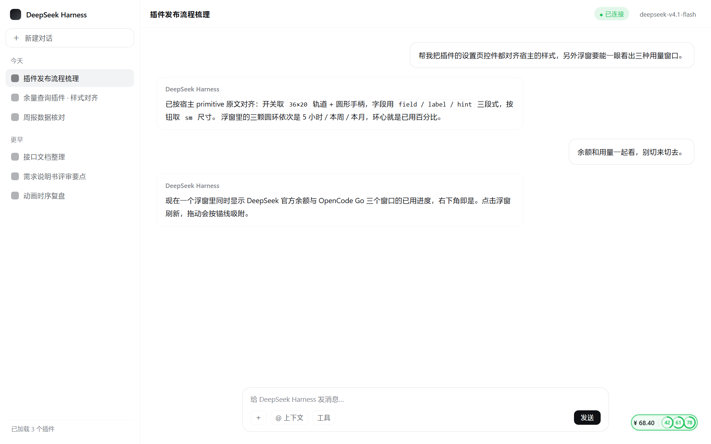

# OCG 余量查询 · dsh-opencode-go-usage

[](LICENSE)

一个 **DeepSeek Harness** 客户端插件：把 **DeepSeek 官方余额** 与 **OpenCode Go** 订阅的三个用量窗口 —— **5 小时（rolling）/ 本周 / 本月** —— 合并到**同一个悬浮胶囊**里，另带一个同名设置页。

> *An unofficial [DeepSeek Harness](https://github.com/deepseek-ai) plugin that shows your DeepSeek balance and OpenCode Go usage (5-hour / weekly / monthly) in one floating pill, with click-to-refresh, drag-to-snap and a light-rail refresh animation.*

## 截图

> 下图为**示意框架**中的渲染：宿主主题令牌逐字取自 DSH 应用包，浮窗与设置页用的是插件自身真实样式（非重绘）。

| 浮窗 · 浅色 | 浮窗 · 深色 |
|---|---|
|  |  |

| 刷新反馈：完成后整圈「封环」 | 形态与配色总览（含刷新中 / 失败 / 分档配色） |
|---|---|
|  |  |

| 设置页 · 浅色 | 设置页 · 深色 |
|---|---|
|  |  |

## 特性

- **一屏两套数据**：DeepSeek 官方余额（`¥` 金额）+ OpenCode Go 三窗口用量；**点击浮窗即刷新**（同时拉取，一侧失败不影响另一侧）。
- **三颗圆环**：环心就是**已用百分比**（不显示 `%`），< 80% 绿 / ≥ 80% 琥珀 / ≥ 95% 红；未用底盘是同色 32% 透明，一眼成套。
- **细光轨反馈**：更新中由发丝光沿胶囊周长**等弧长匀速**跑圈，完成时在弹头当前位置**收束成整圈「封环」**，失败红色同款。
- **拖动吸附**：松手自动吸附到最近的参照线（输入框卡片边 / 窗口边）；窗口尺寸变化、右侧栏开合、对话宽度调整时都按锚线跟随，不会跑位。
- **长宽恒定**：任何状态下浮窗尺寸都不变（反馈层是绝对定位叠加层，不参与布局）。
- **零依赖**：纯原生 JS，**无构建步骤、无第三方运行时依赖**（只 `require('react')`，由宿主提供）。
- **主题自适应**：颜色只取宿主主题令牌 `--dsw-alias-*`，明暗主题自动跟随；开关 / 按钮 / 输入框 / 徽章照抄宿主组件原文（只改类名前缀）。

## 安装

**前置**：DeepSeek Harness 桌面版（应用自带 node / pnpm，无需另装）。本插件按 DSH 官方插件规范编写，**不需要**手写 profile 的 `package.json` / `cordis.patch.yml`，也不要在 profile 目录里跑 pnpm。

在 DSH 里打开 **插件管理页 → 「安装插件」对话框 → 粘贴下面任一 spec → 安装**（对话框调用 pnpm，一次只能装一个）：

| 方式 | 粘贴的 spec |
|---|---|
| **GitHub 直装**（推荐） | `github:verneuil/dsh-opencode-go-usage` |
| **Release 包** | `https://github.com/verneuil/dsh-opencode-go-usage/releases/download/v2.9.5/dsh-opencode-go-usage-2.9.5.tgz` |
| **离线 tgz** | `file:D:/你的路径/dsh-opencode-go-usage-2.9.5.tgz` |

装完按页面提示刷新（替换已安装的 JavaScript 模块代需要重启 DSH）。

- **只受理「组合包」**：插件管理页拒绝没有 bundle patch 的依赖，本包自带 `cordis.patch.yml`，符合要求。
- **升级 = 卸载后重新安装**：插件管理页不提供版本选择器与升级按钮；也可以用新 spec 直接覆盖安装。
- 每个版本的改动见 [CHANGELOG.md](CHANGELOG.md)。

## 使用

- **点击浮窗** = 立即刷新余额 + 用量（也可以等自动刷新）。
- **拖动浮窗** = 移动位置，松手自动吸附；「重置到右下角」按钮可一键回到默认位置。
- **设置页** = `设置 → 插件 → OCG 余量查询`。

## 设置页

- **手动刷新**按钮挂在「OpenCode Go 用量详情」标题行右侧，刷新时间 / 结果提示在按钮左边（成功后显示「已更新（时间）」，**3 秒后自动回落**成「上次更新：…」）。
- **用量详情**：三个窗口的进度条、已用百分比、重置倒计时与接口 status。
- **自动刷新间隔**（分钟，0.5 ~ 1440）。
- **悬浮窗**：一行三件事 —— 「显示DS官方余额」复选框（关掉后浮窗只留三组圆环、自动变窄）、「重置到右下角」按钮、总开关。
- **两把 Key 的覆盖输入**（留空即用 DSH 凭据库；可随时清空改回自动）。
- **每个操作的提示就地出现在该行**（改间隔的提示在「自动刷新」行、开关窗的提示在「悬浮窗」行……），失败红色、成功绿色；提示放在标题行的槽位里，**出现与消失都不顶动排版**（实测同结构字段 `delta = 0`），**停留 3 秒后自动消失**。

因为自带设置页，宿主侧调用了官方的 `settings.configure({ auto: false })` 关掉自动生成的表单页，避免出现两个重复的配置界面。

## 视觉与实现细节

- **常态（迷你胶囊）**：`¥ 余额` + 分隔线 + **三颗圆环**（环心即已用百分比，环外没有 H/W/M 字母标签），浮在界面最上层；**长宽恒定，任何状态下都不改变尺寸**。
  胶囊高 30px（环盒 20px + 四边内边距 4px + 1px 边框）；内边距按圆环**视觉外径**留白 —— 环视觉 24px 四向各溢出 2px，故环到边框**四边净空一致 2px**（`padding: 4px`）；端头是半径 15px 的圆弧、与环心**同心**（内缘 14px vs 环外缘 12px），所以圆角平行于圆环弧度、整圈间隙均匀；圆环外径 24px（环盒 20px），已用百分比以 **9.5px** 数字收在**环心**（不显示 `%`）—— 两位数百分比也不拥挤。
  三颗环从左到右依次是 **5 小时**（rolling）/ **本周**（weekly）/ **本月**（monthly），完整口径在 `aria-label`、浮窗 `title` 与设置页标题里。
- **点击 / 自动刷新**：反馈做成**细光轨**（叠加层，不参与布局，所以不会把浮窗撑大或撑长）：更新中 = **1.15px 发丝光**沿胶囊周长**等弧长匀速**跑圈（SVG 描边 + `pathLength` 归一化，不再有宽胶囊上的「中段飞驰、两端爬行」），光带由**七层彗尾**叠出指数衰减（末端透明度压到 0.10，让它「化掉」而不是一刀切断）+ **白热弹头 / 白热芯**带外发光，另有一道更暗更慢的辅轨（1.35s / 2.15s 不同周期）交织；完成 = 光在**弹头当前位置**收束成整圈「封环」，收口瞬间一次 `drop-shadow` 爆闪，再轻呼吸停留；失败 = 红色同款 + 双击一次；**3 秒后淡出**。
  > 收笔位置由 JS 在相位切换前读出并冻进 `--ocgu-frozen-a / -b`：浏览器在动画属性变化时会重建动画、`--ocgu-run` 归零，不冻住的话彗尾会瞬间跳回起点（看着就是「后半段突然一条长线」）。
- **自动刷新**：宿主在真正拉取前先回写 `refreshTick`，浮窗立刻亮起**和手动点击完全一样的边框流光**，出结果后转全绿 / 全红并再停 **3 秒**淡出（25 秒兜底收回，不会一直转）。
- 配色（红绿灯）：< 80% 绿、≥ 80% 琥珀、≥ 95% 红。浮窗圆环里**已用弧 = 满色**、**未用底盘 = 同色 32% 透明**、环心数字同色；设置页的横向进度条仍从品牌色起步。

## 数据来源

```
GET https://opencode.ai/zen/go/v1/usage                    # OpenCode Go 用量
Authorization: Bearer <OpenCode Go API Key>

GET https://api.deepseek.com/user/balance                  # DeepSeek 官方余额
Authorization: Bearer <DeepSeek API Key>
```

用量接口返回 `{ usage: { rolling, weekly, monthly } }`，每个窗口含 `status` / `percent`（**已用**百分比）/ `resetsAt`；余额接口返回 `balance_infos[]`（优先取 CNY 行）。
宿主半侧负责拉取与解析（两把 Key 都不出宿主进程），客户端只读宿主写入的配置投影。

**Key 来源**（两侧各自独立，按优先级）：

1. 插件设置页里的「手动 Key」（写入本行配置持久化，客户端视图自动脱敏）；
2. DSH 凭据库 —— OpenCode Go 取 `OPENCODE_GO_API_KEY`（其次 `OPENCODE_API_KEY`），DeepSeek 取 `DEEPSEEK_API_KEY`。

## 构型

| 部分 | 位置 | 说明 |
|---|---|---|
| Bundle 清单 | `package.json` | `dsh.bundle.patch` + `dsh.client`（platform web、immediately）+ `icon` + `locale/*.json` 显示元数据 |
| Loader patch | `cordis.patch.yml` | 插入一行 `id: opencode-go-usage`（本行 id 同时是设置表单的 ns） |
| 宿主半侧 | `index.js` | `export const Config`（schemastery）+ `apply(ctx, config)`；拉取、解析、写回快照、自动刷新 |
| 客户端半侧 | `client.js` | `window.__ModuleLoader__` 惰性工厂；只 `require('react')`，注册进 `shell.overlay`（浮窗）与 `settings.section`（设置页） |

## 配置项

设置页覆盖了常用项；下表中的字段也可以直接改本行 patch 的 `config`。

| 字段 | 说明 |
|---|---|
| `apiKey` | OpenCode Go 的手动 API Key（secret）。留空则自动使用 DSH 凭据库 |
| `deepseekApiKey` | DeepSeek 的手动 API Key（secret）。留空则自动使用 DSH 凭据库 |
| `refreshMinutes` | 自动刷新间隔（分钟，默认 5）；一轮同时刷新余额与用量 |
| `widgetVisible` | 浮窗显示开关 |
| `showBalance` | 浮窗上是否显示 DeepSeek 官方余额（默认开） |
| `widgetAnchorX/Y`、`widgetOffsetX/Y` | 浮窗锚定（拖动时由客户端写入，无需手改） |
| `refreshRequest` | 手动刷新计数（点击浮窗时由客户端递增） |
| `refreshTick` | 宿主每轮拉取前自增的「更新中」信号（客户端只读，用来点亮边框流光） |
| `keyStatus`、`keyHint`、`usageError`、`lastUpdated`、`usage` | OCG 用量的派生快照（宿主写入，客户端读取） |
| `balanceKeyStatus`、`balanceKeyHint`、`balanceError`、`balance` | DeepSeek 余额的派生快照（宿主写入，客户端读取） |

## 稳健性设计

- **只占官方为浮层保留的席位** `shell.overlay`（`replaceRisk: none`，点击穿透层，条目自行 opt-in 指针事件）；用自有 `id` 注册，属于「加在既有条目旁边」，不替换任何官方条目。
- **不遮蔽任何官方 UI**：不注册 `conversation.composer.dock`，不复刻官方组件。
- **样式只用主题令牌** `--dsw-alias-*`：令牌改名最多让外观退化，不会让渲染崩溃；无阴影、无模糊、无字面色值。
- **不引入任何 Harness 客户端包**（如 `dsh-client-ui-primitives`）：这类包随时会变，且普通 JS 插件没有类型检查；浮窗的控件全部自写。
- **宿主 API 契约自检**：启动时校验本插件实际用到的宿主契约，不匹配时打印可读警告并安全跳过，而不是抛 `TypeError` 让整条目静默不激活。
- **配置即通道**：宿主把派生快照写进本行 Config 的 volatile 字段，客户端经 `remote.settings.describe()` 读取；写回在 HMR 事务之外提交（避免 `HMR transactions cannot be nested`）。
- **失败不清空数据**：拉取失败时保留最后已知用量（并做 3s / 10s 抗抖动重试），不会因为一次网络抖动把进度条清成 `--` 或把空值持久化。
- 未取到 Key 时按阶梯重试（3/8/20/40/60/120 秒），手里有成功快照时容忍三次失手，避免启动瞬间误判「未配置」。

## 已知限制与免责声明

- **非官方插件**：本项目与 DeepSeek、OpenCode 官方**无任何隶属关系**；两个接口都不是官方长期冻结的公开契约，上游结构大改时可能失效（解析器已对「剩余百分比 / 已用金额与额度 / 距重置秒数」等常见变体做容错，失败时宿主会在 `usageError` 里给出可读文本）。
- **Key 只在本机使用**：宿主半侧直接请求上述两个接口，不经过任何第三方；设置页里填写的手动 Key 存在本机插件配置中，界面上只显示脱敏掩码（如 `sk-****5590`）。
- **网络抖动**：跨境 HTTPS 偶发超时属正常，此时浮窗保持**最后已知数值**、边框转告警色，宿主按 3/8/20/40 秒重试，成功后自动恢复。
- **界面语言**：浮窗与设置页文案为中文（未接入客户端 locale 字典）。
- **使用风险自负**：本软件按 MIT 许可「原样」提供，不附带任何担保。

## 许可

[MIT](LICENSE) © 2026 verneuil

## 反馈

问题与建议请开 [Issue](https://github.com/verneuil/dsh-opencode-go-usage/issues)，欢迎 PR。每个版本的改动记录见 [CHANGELOG.md](CHANGELOG.md)。
